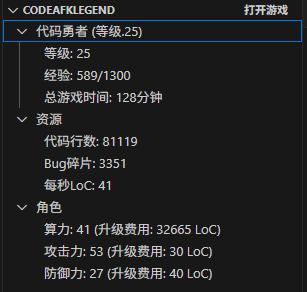
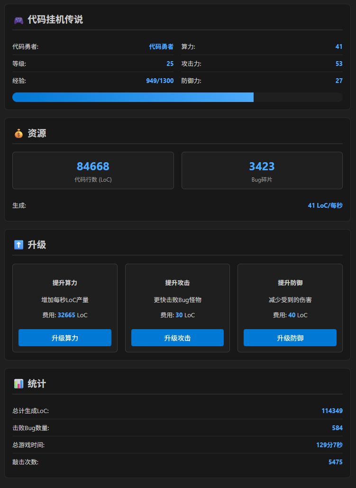

# 代码挂机传说 / Code AFK Legend

[](https://marketplace.visualstudio.com/items?itemName=your-publisher.legend-of-idle-coding)
[](LICENSE)
[](https://github.com/runbrick/code-afk-legend/stargazers)
[](https://github.com/runbrick/code-afk-legend/issues)

一款在 VS Code 中运行的创新挂机游戏扩展，让你在编程的同时体验 RPG 游戏的乐趣！


## 🎮 项目描述 / Project Description

代码挂机传说是一款独特的 VS Code 扩展，将传统的挂机游戏元素与日常编程工作完美结合。当你在 VS Code 中编写代码时，游戏角色会自动获得经验值、代码行数和各种奖励。通过真实的编程活动来推进游戏进度，让枯燥的编程工作变得更加有趣和有成就感。


## ✨ 游戏介绍 / Game Features

### 🚀 核心玩法 / Core Gameplay

- **📊 自动资源生成** - 基于算力自动生成代码行数 (LoC)
- **⚔️ 自动战斗系统** - 与各种编程 Bug 怪物战斗
- **📈 角色升级** - 通过编程活动获得经验值升级
- **🛠️ 属性升级** - 使用 LoC 提升算力、攻击力、防御力
- **📋 实时统计** - 追踪你的编程活动和游戏进度


### 🌍 多语言支持 / Multi-language Support

- **🇨🇳 简体中文** - 完整的中文界面
- **🇺🇸 English** - Full English interface
- **🔧 可扩展** - 支持第三方语言包
- **🎯 智能检测** - 根据 VS Code 语言自动切换


### 🎯 编程互动 / Programming Interactions

- **⌨️ 按键奖励** - 每次敲键都有概率获得额外奖励
- **💾 保存奖励** - 保存文件时获得经验和代码行数
- **📂 文件奖励** - 打开不同类型文件获得不同倍率奖励
- **🐛 特殊事件** - 编写特定代码模式时触发 Bug 战斗


## 📷 游戏截图 / Screenshots

### 侧边栏视图 / Sidebar View


### 游戏主面板 / Main Game Panel


## 🚀 安装使用 / Installation

### 从 VS Code 市场安装 / Install from VS Code Marketplace

1. 打开 VS Code
2. 按 `Ctrl+Shift+X` (Windows/Linux) 或 `Cmd+Shift+X` (Mac) 打开扩展面板
3. 搜索 "代码挂机传说" 或 "Code AFK Legend"
4. 点击安装
5. 重启 VS Code

### 从源码安装 / Install from Source

```bash
# 克隆仓库
git clone https://github.com/runbrick/code-afk-legend.git
cd code-afk-legend

# 安装依赖
npm install

# 编译项目
npm run compile

# 复制语言文件
npm run copy-resources

# 打包扩展
vsce package

# 安装 .vsix 文件
code --install-extension legend-of-idle-coding-0.0.1.vsix
```

## 🎮 游戏玩法 / How to Play

1. **开始游戏** - 安装扩展后，侧边栏会出现 "CodeAFKLegend" 面板
2. **打开游戏面板** - 点击面板中的 "打开游戏" 按钮或使用命令面板
3. **开始编程** - 正常进行编程工作，游戏会自动在后台运行
4. **升级属性** - 收集足够的代码行数后，在游戏面板中升级各种属性
5. **战斗怪物** - 游戏会随机生成 Bug 怪物，自动进行战斗
6. **查看统计** - 在游戏面板底部查看详细的编程统计信息

## 📋 命令列表 / Commands

| 命令 / Command | 描述 / Description |
|---|---|
| `代码挂机传说: 打开游戏` | 打开游戏主面板 |
| `代码挂机传说: 重置游戏` | 重置所有游戏进度 |
| `代码挂机传说: 切换语言` | 切换游戏界面语言 |

## ⚙️ 配置选项 / Configuration

当前版本的配置选项通过游戏内设置管理：

- **自动保存** - 是否自动保存游戏进度
- **显示通知** - 是否显示游戏事件通知
- **语言设置** - 选择游戏界面语言


## 🎯 未来计划 / Roadmap

### 🔥 近期计划 (v0.1.x) / Short-term Plans

- [ ] **装备系统** - 键盘、IDE插件、调试器、咖啡机等装备
- [ ] **成就系统** - 各种编程成就和里程碑
- [ ] **技能树** - 不同编程语言的专精技能
- [ ] **更多 Bug 类型** - 增加更多种类的 Bug 怪物
- [ ] **声音效果** - 添加战斗和升级音效

### 🚀 中期计划 (v0.2.x) / Medium-term Plans

- [ ] **多人模式** - 团队协作和排行榜功能
- [ ] **插件生态** - 第三方插件和主题支持
- [ ] **云端存档** - 跨设备同步游戏进度
- [ ] **AI 助手** - 智能编程建议和游戏策略
- [ ] **更多语言包** - 支持更多国际化语言


### 🌟 长期愿景 (v1.0+) / Long-term Vision

- [ ] **虚拟经济** - 代币系统和 NFT 集成
- [ ] **VR/AR 支持** - 沉浸式编程游戏体验
- [ ] **教育模式** - 编程学习和教学工具集成
- [ ] **企业版** - 团队协作和项目管理功能
- [ ] **开源生态** - 完整的开源插件开发框架


## 🤝 贡献指南 / Contributing

我们欢迎所有形式的贡献！无论是 bug 报告、功能建议、代码贡献还是文档改进。


### 📝 如何贡献 / How to Contribute

1. **Fork** 本仓库
2. **创建**功能分支 (`git checkout -b feature/AmazingFeature`)
3. **提交**你的更改 (`git commit -m 'Add some AmazingFeature'`)
4. **推送**到分支 (`git push origin feature/AmazingFeature`)
5. **创建** Pull Request

### 🐛 报告 Bug / Bug Reports

请使用 [GitHub Issues](https://github.com/runbrick/code-afk-legend/issues) 报告 bug，并提供以下信息：

- VS Code 版本
- 扩展版本
- 操作系统
- 复现步骤
- 预期行为
- 实际行为
- 相关截图


## 📜 开源协议 / License

本项目基于 [MIT License](LICENSE) 开源协议。


## 🙏 致谢 / Acknowledgments

- **VS Code 团队** - 提供了优秀的扩展开发平台
- **开源社区** - 各种优秀的开源库和工具
- **测试用户** - 提供了宝贵的反馈和建议
- **贡献者们** - 每一个为项目做出贡献的人

---

**让编程变得更有趣！Happy Coding! 🚀**
